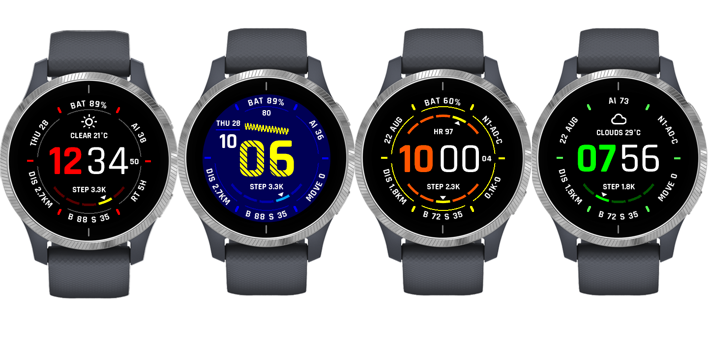

A watchface for Garmin devices, available free on the [Garmin App Store](https://apps.garmin.com/apps/f86d1406-8272-4ede-abe5-cc566dd8e2d6)

# Description

⭐️ Infocal is a digital and analogue watchface, with unique curved text
around the edge of the display.

It's both customizable and functional. With up to 8 data fields on the screen, your watchface can show a variety of data to suit your needs:

- Active minutes (total, moderate, vigorous)
- Air Quality
- Elevation (altitude)
- Barometer (air pressure)
- Battery (% / time in days)
- Calories used (total/active)
- Countdown to event day
- Custom text
- Date (various formats)
- Distance (day/weekly)
- Floors climbed
- Heart rate
- Health (Body Battery, Stress Score, Recovery Time)
- Move bar
- Phone Notification/alarm/connection status
- Steps
- Sunrise/Sunset time
- Temperature (on-device sensor)
- Temperature (Garmin weather)
- Temperature (OpenWeather)
- Temperature (high/low, OpenWeather)
- Time (current, additional timezone, sunrise / sunset)
- Weather conditions (OpenWeather, Wind)

---

⭐️ Weather data provided by [OpenWeather](https://openweathermap.org/)

&nbsp;&nbsp;&nbsp;&nbsp;&nbsp; 

⭐️ Air Quality data provided by [IQAir](https://www.iqair.com/)

&nbsp;&nbsp;&nbsp;&nbsp;&nbsp; 

---

# Supported Devices

- Compatible with a broad range of Garmin devices including: D2, Descent, Epix,
  fēnix, Forerunner, Instinct, MARQ, Venu, Vivoactive product families.
- Minimum Connect IQ API level: 2.4.0.
- For the full, authoritative list, see the [manifest.xml](manifest.xml), or the “Compatible Devices” list
  on the [Garmin App Store](https://apps.garmin.com/apps/f86d1406-8272-4ede-abe5-cc566dd8e2d6).

# Configure Settings

There are a few alternative ways to change the Watch settings:
- Use the Connect IQ App on your phone (recommended)
- Use the [Connect IQ Store App](https://support.garmin.com/en-US/?faq=9rNKwEDKMj2FAxqUVrsudA) on your phone
- Use [Garmin Express](https://support.garmin.com/en-CA/?faq=6Vl7EbW3qA42l63ZIhJet5) application on your computer

## Configurations

- **Colors**: pick a color theme, or fully customize the look of your watchface
- **Clock Style**: choose from 4 digital and one analog clock styles
- **Data Fields**: up to 8 data fields can be configured
- **Custom Data**:
  - Custom Countdown Event date and Text
- **API Keys** (optional but recommended):
  - **OpenWeather**: add your key in settings for more frequent weather updates.
  - **IQAir**: add your key in settings for more frequent updates
- **Time and date formats** pick among multiple date and time formats. Optionally configure a secondary timezone

## Permissions

- **Background**: schedules background tasks that fetch weather/air quality and send a lightweight heartbeat.
- **Communications**: performs web requests for OpenWeather, IQAir, and heartbeat via the phone connection.
- **Positioning**: uses gps location to resolve nearest weather/air quality and for sunrise/sunset times.
- **SensorHistory**: reads historical steps/active minutes, etc., to render graphs and summaries.
- **UserProfile**: used to compute active calories, distance goals, and weekly distance (stride length based).

# FAQs

### ⭐️ FAQ 1: How do I get my Free Air Quality API KEY?

Create a free account and obtain a free api key from the IQAir Website:

https://dashboard.iqair.com/personal/api-keys

Once you have your free api key, you will need to copy this into the Watchface Settings (go to Settings, Custom Data and paste into the text box; then click the back arrow and then Save):

https://support.garmin.com/en-US/?faq=9rNKwEDKMj2FAxqUVrsudA

### ⭐️ FAQ 2: Why does my watch display "ERR 429", or "API KEY"?

Air Quality data and Weather data are provided by an external service. The watchface includes a pre-installed api key to get you up and running right away. To continue receiving Air Quality data, you need to request your own free api key - see FAQ 1.

### ⭐️ FAQ 3: Why does my watch display "ERR [number]"?

This normally indicates an internal error. Use the App Support/Contact Developer button to message me so I can fix it.

### ⭐️ FAQ 4: Why does the "Days left" Battery format display "WAIT"?

The watchface is calibrating for your battery usage. The battery must deplete by at least 2% to take a first sample; the "Days left" field will learn your battery usage over a few days.

### ⭐️ FAQ 5: What do all the Health and Physiological metrics tell me?

See Garmin's Health Science and Physiological measurements articles:

• https://www.garmin.com/en-US/garmin-technology/health-science/

• https://www.garmin.com/en-GB/garmin-technology/running-science/physiological-measurements/

### ⭐️ FAQ 6: The Watchface crashed and displayed an "IQ!" icon. What should I do?

1. Update to the latest version - it may be fixed in the latest version. 2. Undo any recent settings changed. 3. Use the App Support/Contact Developer" button to message me so I can fix it.

### ⭐️ FAQ 7: Why does the sunrise/sunset/OpenWeather information display "NO LOCN" or "--"?

Weather and sunrise/sunset requires to know the current location to provide a reading. Try starting any activity that requires GPS, then wait for GPS signal. Once a GPS signal is established, return to watch face and check the complication again.

### ⭐️ FAQ 8: Why is a field just showing "--"?

Not all complications are supported on all devices, or there is no data to display at the moment. This could be because the data isn't available (e.g., Stress is not always calculated), or the complication relies on a GPS signal that has not been established.

### ⭐️ FAQ 9: A blank square is shown instead of a character?

Currently, this watch face only supports English (or Latin characters). Set the
"Force date to English" setting on to avoid this issue.

### ⭐️ FAQ 10: How do I get my free OpenWeather API key?

Go to https://openweathermap.org/, create an account, and log in. Once logged in, click on your account name in the upper right corner, then click on "My API keys". If you do not have any keys, click "Generate" and copy the newly generated key to the Infocal settings.

## Weather / Air Quality Troubleshooting

- **Location required**: sunrise/sunset, weather and Air Quality require a valid GPS location. Start an activity to acquire GPS, then return to the watchface.
- **Phone connectivity**: ensure the watch is connected to your phone for web requests; and your phone has an internet connection.
- **Update rates**: add your personal API keys to update data every 30 minutes.  The pre-installed API keys are limited to updating every few hours
- **Data unavailable**: not all complications are supported on all devices, or data may be unavailable at that time (e.g., stress not continuously calculated).

---

# Credits

- ⭐️ Weather data provided by OpenWeather https://openweathermap.org/

- ⭐️ Air Quality data provided by IQAir https://www.iqair.com/ca/world-air-quality

I am not affiliated with either company - but I do think they're pretty awesome providing world-wide, accurate Weather and Air Quality data free of charge - and I think you will too :)

- ⭐️ This project was forked from [Infocal](https://github.com/RyanDam/Infocal), and would not exist if not for the work RyanDam put into that project.

- ⭐️ Special thanks to **[warmsound](https://github.com/warmsound)** for awesome [Crystal Watchface](https://github.com/warmsound/crystal-face).

- ⭐️ Special thanks to **[sunpazed](https://github.com/sunpazed)** for his awesome GitHub projects.

This project is free and will remain free under the MIT License.

---

# Privacy & GDPR Compliant

* This app sends a periodic 'heartbeat' message, containing anonymized product/version information.
* The heartbeat message contains: anonymized unique id, device part number, firmware version,
  software version, connect iq version, language and country code, and recently-used features.
* No personally identifiable information or IP addresses are ever collected or stored by the app.
* Data is processed and retained only for the purpose of anonymized product usage,
  product health, and service availability monitoring.
* By downloading and using this app you consent to anonymized data processing.

---

# Build From Source

Prerequisites:
- Garmin Connect IQ SDK (via SDK Manager)
- VS Code 'Monkey C' extension

# Secrets / Keys Setup

For development, copy `source/Keys.mc.example` to `source/Keys.mc` and replace the placeholder values:
- `getOpenWeatherDefaultKey()`: default OpenWeather key used when a user key isn’t set
- `getIQAirDefaultKey()`: default IQAir key used when a user key isn’t set
- `getWorkerToken()`: auth token for the heartbeat worker

_Note: Never commit real keys to source control._

# Repo Architecture

- Foreground app renders the UI and schedules background jobs.
- Background clients live in `source/clients/*` (OpenWeather, IQAir, Heartbeat) and perform minimal parsing to reduce memory usage.
- Background scheduling and request orchestration are triggered from the main view. See: `source/InfocalView.mc:590`.

# Contributing

- Issues and PRs are welcome. Please keep changes scoped and follow the existing code style.
- See `TODO.md` for known issues and enhancements that are good starting points.

# What’s New

- See the Git revision history, or the [Garmin App Store](https://apps.garmin.com/apps/f86d1406-8272-4ede-abe5-cc566dd8e2d6) release notes.
